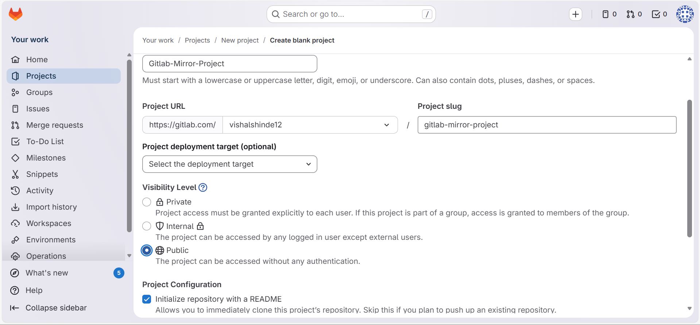
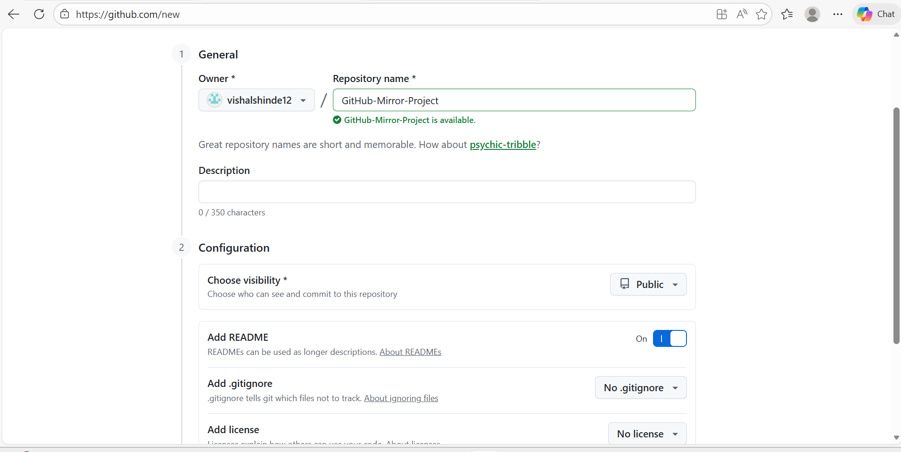
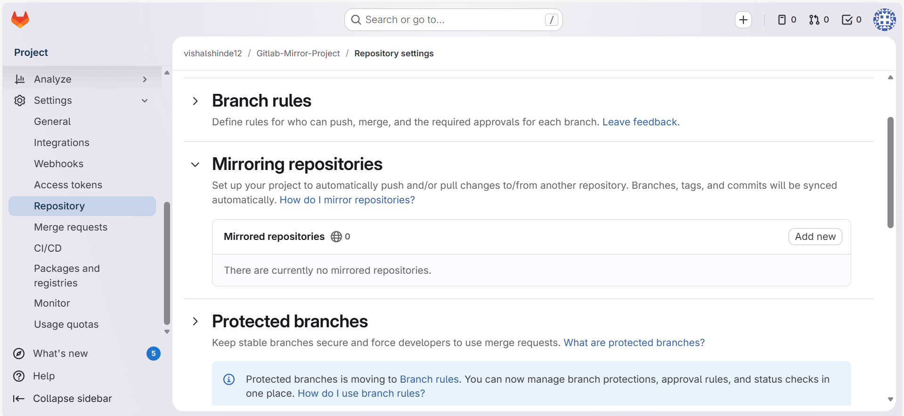
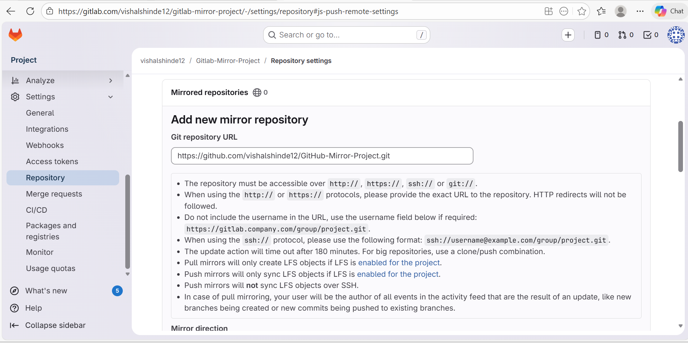
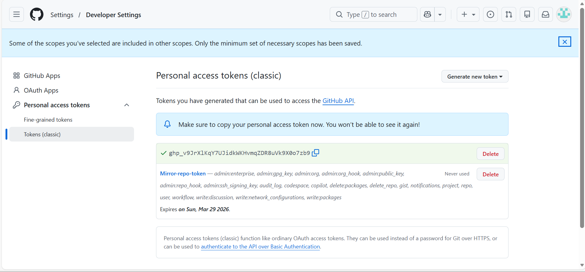
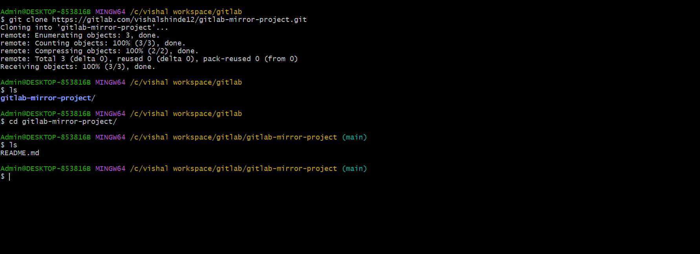
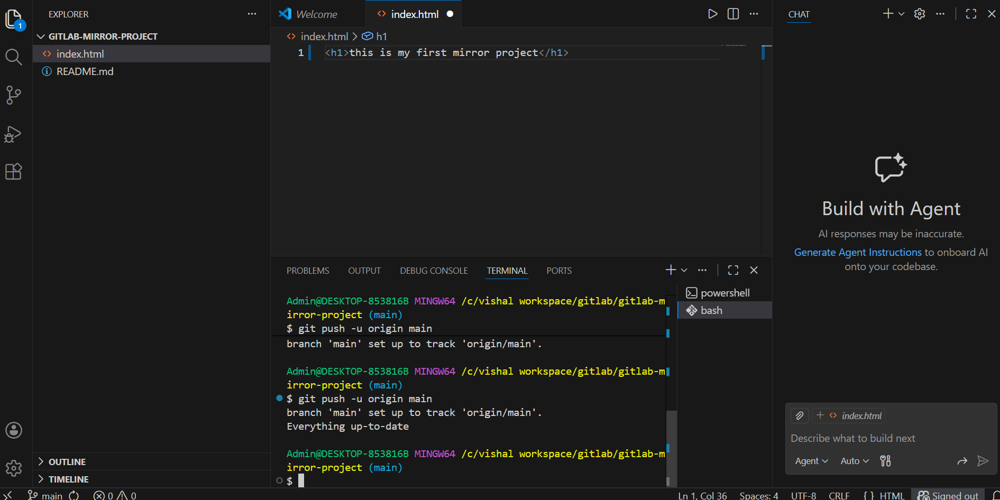
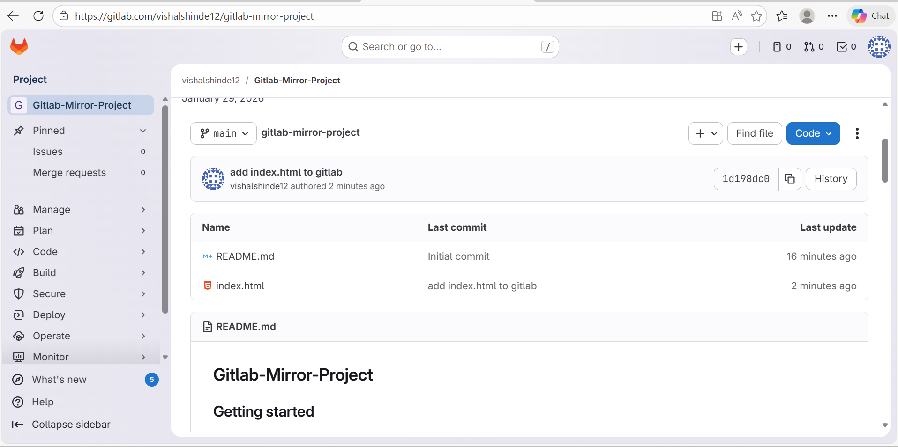
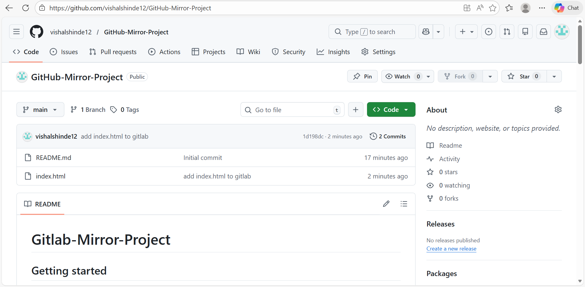

## Git-Mirror-Project (Gitlab to GitHub)

## Introduction :
### The GitLab to GitHub Mirror Project bridges these ecosystems by automatically synchronizing repositories between GitLab and GitHub. This setup ensures that code hosted on GitLab can be mirrored to GitHub in real time

## Steps :

### Step 1 :
```
Create a blank project in gitlab account
# As Gitlab-Mirror-Project
# select visibility level as public
# checkin the intialize repo with Readme to make the default branch as main
```


### Step 2 :
```
Create a repository in GitHub account 
# As GitHub-mirror-Project
# On the Add Readme checkbox to make the default branch as main on GitHub also
```


### Step 3 : 
```
# Now go to the settings in gitlab acc
# go inside the reositories section
# configure the mirroring repositories
```


```
Configuration :
1. give the URL of github repo which was created

2. next give the username of your github account

3. instead of password add the personal access token by creating from github account
```


### Step 4 :
```
To create personal access token in github

1. Go to the settings of your account 

2. Next go to the developer's settings

3. Click on "Tokens(classic)"

4. Then "Generate New Token(classic)"

5. Give name to your Token and also give the expiration date of token as well as checkin all the access box

6. Create the Token

7. Copy and paste that token in password section where you nedd to give username and password of Github when you enable mirroring in Gitlab
```


### Step 5 :
```
# Create a folder on your local machine and open git bash

1. Clone the code of your blank project from gitlab but copy it as HTTPS code as you made your project public
```


### Step 6 :
```
# Now open the VS Code editor using "code . ; exit" command

# Create a file like index.html

# put some code in that file 
```
```
 To push the command use
 # git add .
 # git commit -m <messege>
 # git push -u origin <default branch>

 Note : you don't nedd to give the command like "git init" because when you work from remote repo it automatically initializes the process
 ```
 

 ### Step 7 :
 ```
 Now refresh the  Gitlab project as well as the Github repo

 # we see that the index.html file added in Gitlab project

 # Also the index.html file mirrored in Github repo
 ```
 

 


